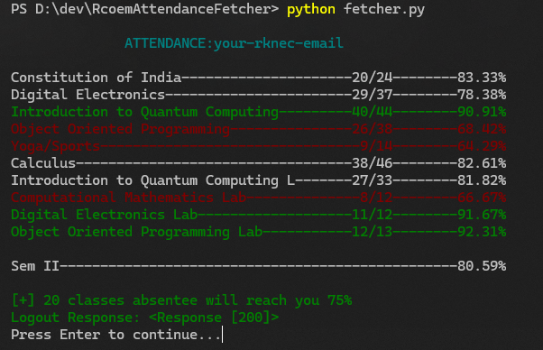

# Rcoem-Attendance-Fetcher
> A Python script to fetch Rcoem college attendance right into the terminal and shows real-time info to maintain minimum attendance.

`Rcoem-Attendance-Fetcher` allows you to access your Rcoem attendance directly into your terminal from [RCOEM.in](rcoem.in) in a colorful format.



## Color scheme
Below is subject wise color scheme:
```diff
- attendance < 75%          (red)
# 75% < attendance < 85%    (white)
+ 85% < attendance          (green)
```

it also shows you how much classes are `required/you can miss` so that 75% attendance will be maintained. I don't encourage missing classes 😁

## Installation

```sh
git clone https://github.com/devvratmiglani/Rcoem-Attendance-Fetcher.git

cd Rcoem-Attendance-Fetcher

pip install -r requiremenst.txt
```

### Adding Credentials
you have to add your credentials to `auth/auth.json` as well as the semester

semester : 0 --> gives attendance of all previous + current
semester : x --> gives attendance of that respective semester

### Usage 
Use as:
'''sh
python -u fetcher.py
'''


